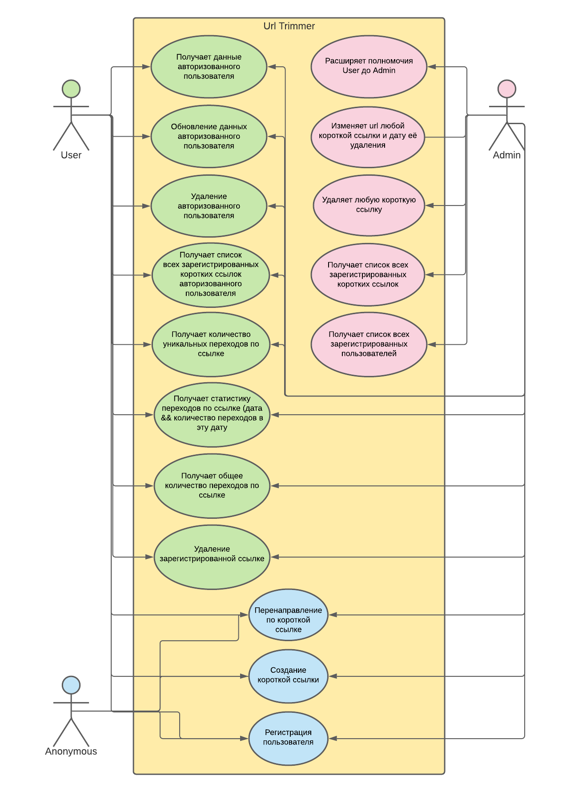

# Urltrimmer

# Требования к сервису в порядке усложнения:

* Возможность создать короткую ссылку по полному URL, алгоритм генерации - на Ваше усмотрение.
* Короткая ссылка должна содержать символы из диапазона: [0-9, a-z].
* По известной короткой ссылке осуществить перенаправление браузера пользователя на исходный URL.
* Управление ссылками должно быть доступно только ограниченному кругу лиц.
* Предусмотреть возможность удаления зарегистрированных коротких ссылок.
* Предусмотреть возможность задания ограничение на срок “жизни” короткой ссылки.
* Осуществлять подсчет количества переходов по ссылке.
* Предоставлять статистику переходов по ссылкам в любом виде на Ваше усмотрение.
* Осуществлять подсчет уникальных переходов по ссылке, метод определения уникальности - на Ваше усмотрение.

# Как запустить?

- #### Инструкция:

    * [Скачайте](https://github.com/Winston-psvm/Urltrimmer/archive/refs/heads/master.zip) и разархивируйте проект или сделайте [GitClone](https://github.com/Winston-psvm/Urltrimmer.git).
    * Просто запускаете UrlTrimmerApplication.
  
- #### через [Docker](https://www.docker.com)
  * Run: <pre>docker run -p 8080:8080 winstonidsigi/urltrimmer:shorter</pre>
  
# Как это работает?

 Для удобного просмотра, после запуска, я предлагаю [Swagger](http://localhost:8080/swagger-ui/index.html?configUrl=/v3/api-docs/swagger-config#/).

 Для авторизации как User, я предлагаю следующие данные (Username (user@yandex.ru), Password (password)), авторизация админом - (Username (admin@gmail.com), Password (admin)).
 #### Учтите, redirect в swagger не перенаправляет, используйте строку запроса браузера.
